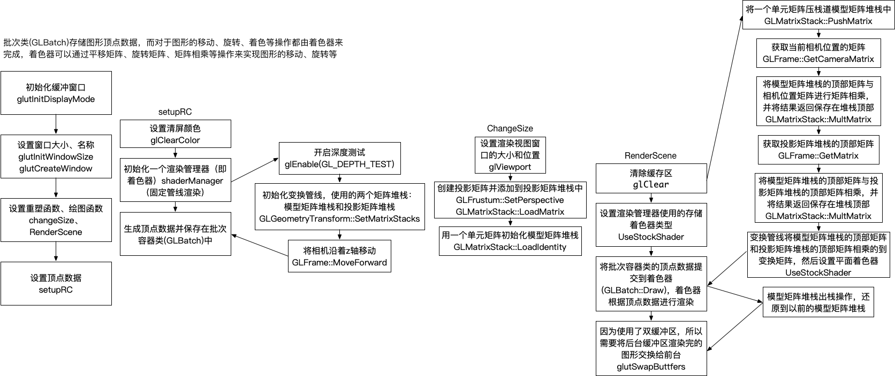

# OpenGL学习
+ OpenGL-Rectangle  
通过键盘的方向键控制矩形的上下左右移动，移动的同时绕z轴旋转
+ OpenGL-GeometricPrimitives  
7种几何图元的渲染
+ OpenGL-Front_Back_Cull-Depth_Test  
正面背面剔除 & 深度测试  
+ OpenGL_Blend  
颜色混合  
+ OpenGL-Antialiasing-Multiple_Sample  
抗锯齿 & 多重采样  

<text align="center">代码逻辑图</text>
